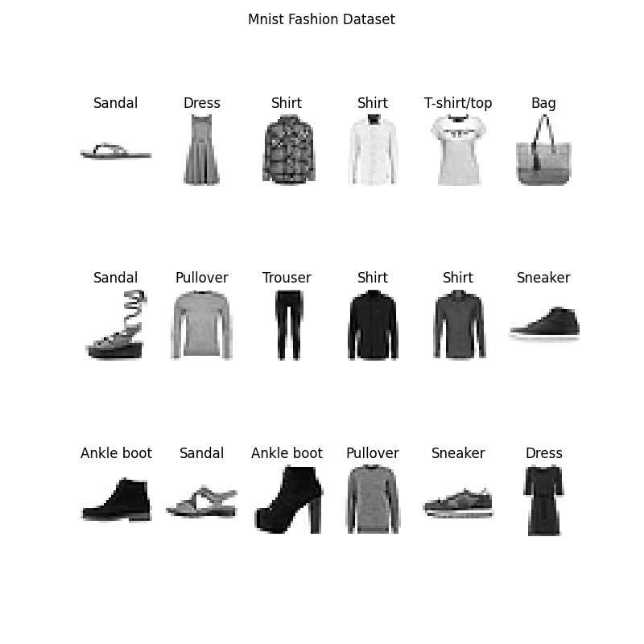
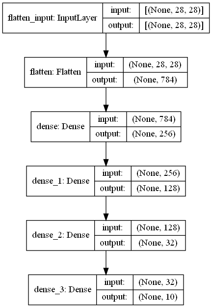
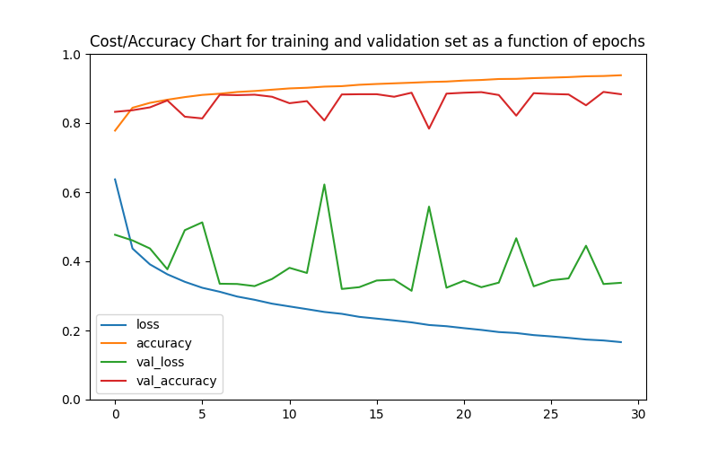
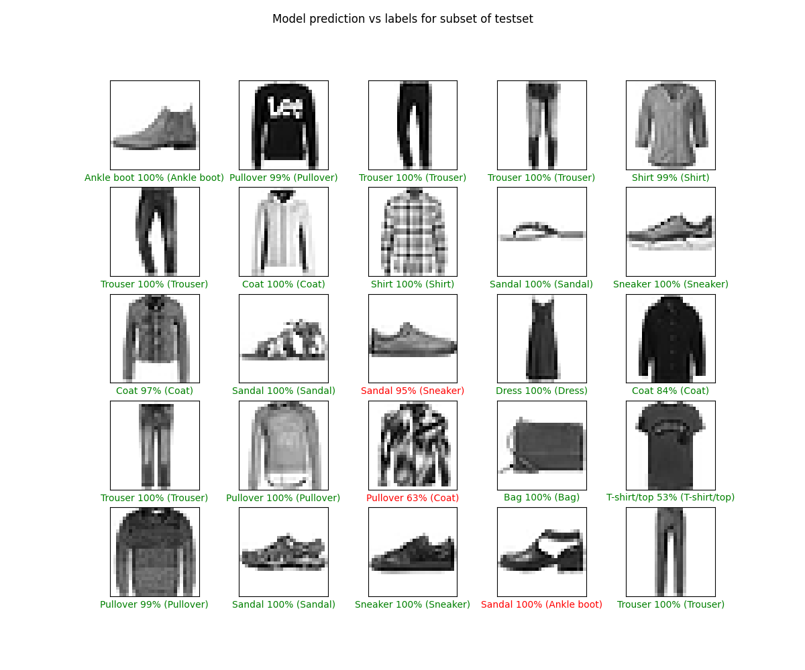

# MNIST Fashion Dataset covnet using Keras/Tensorflow 2.6

This is a mini project that aims to showcase my ability to read documention and my knowledge of covnet, keras, and lifecycle of a deep learning project.

The data is available at : [Data API from Keras](https://keras.io/api/datasets/fashion_mnist/)

Some documentaton is available at: [Classification Documentation](https://www.tensorflow.org/tutorials/keras/classification)

Library used: Keras/Tensorflow, Pandas, Numpy, Matplotlib, Pickle ..etc.

# Description

Train-Model is used to load in Fashion-Mnist dataset which is a dataset of 60000 28x28 grayscale images of 10 fashion categories.
The scripts loads the data, preprocess it (just scaling it down to values between 0-1) and creates a covnet of 5 hidden layer.

For example:

The layers consist of:

1. Flatenning of the 2D image into 1D vector
2. A Dense layer with 256 hidden nodes with Relu activation
3. A Dense layer with 128 hidden nodes with Relu activation
4. A Dense layer with 32 hidden nodes with Relu activation
5. Finally the output layer with 10 nodes usign Softmax since every category is mutually exclusive (This means that the sum of the probabilities of all possible outcomes should add up to 1 or in simple terms 1 image can only have 1 category).

Below is a summary of the covnet architecture.:

The process was iterated a few times to fine tune some of the hyperparameters.
I found that the learning rate was better at 0.02 with a SGD.
Just based trial and error, fixing the epoch at 30 was ideal as the cost was starting to flatten
Anything higher seems to be overfitting. And anything below isn't as accurate.
(Note for simplciity sake, the neurons or number of layers weren't tweaked with, but they are hyperparameters as well).

As shown in the figure, the accuracy of the training set and of the validating set are similar.
Thus it shows that there isn't too much overfitting involved.
The Losses were also starting to flatten/converge to a horizontal line showing that 30 epoch is fine.

# Results

The model was tested on the testing set producing an accuracy of 0.8871 OR 88.71%
By itself it's not super intuitive, as such i grabbed a small subset of the test set to show what their predictions are like (along their probability) and point out some wrong predictions from the model.

A key observation is that the model seemed to struggle with the shoes category (sandles, boots..etc).

To access the model:
[model.h5](results/Keras_CNN_model.h5)

# To do next:

1.  Host the model with AWS Sagemaker (in progress) - Just the endpoitn to make predictions
2.  Create a front end for users to be able to test their own image (if that's the case will need to add more layers such as convolutions and pooling since regular images are much higher quality and need some additional preprocessing.)
